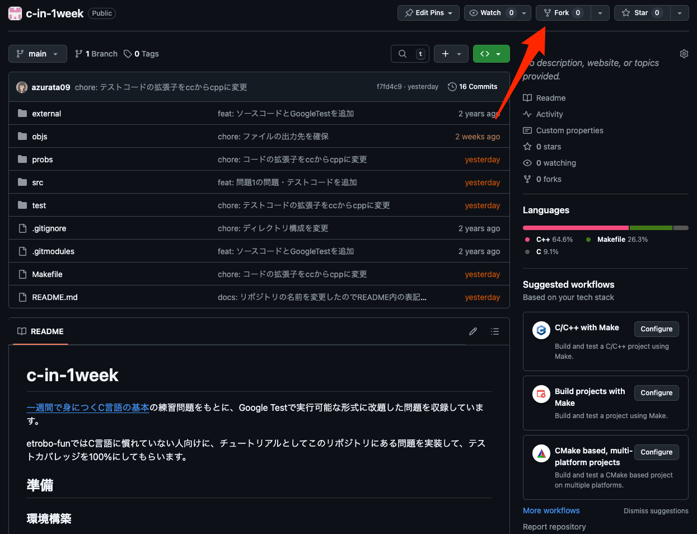
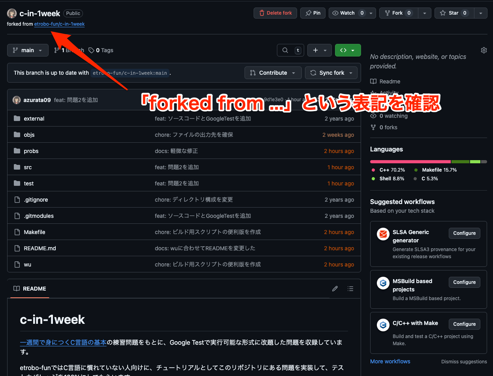

# c-in-1week

[一週間で身につくC言語の基本](https://c-lang.sevendays-study.com/index.html )の練習問題をもとに、Google Testで実行可能な形式に改題した問題を収録しています。

etrobo-funではC言語に慣れていない人向けに、チュートリアルとしてこのリポジトリにある問題を実装して、テストカバレッジを100%にしてもらいます。

## 準備

### 環境構築

etrobo環境を構築済みとする。いずれの操作もetrobo環境で行うこと。（一応、cmakeとgccが入っていれば動くはず。）

> [!NOTE]
> $は「この行が表すのはコマンドですよ」という意味なので、入力しない。
>
> 例: `$ echo Hi`と書かれていたら、`echo Hi`だけ入力する。

まず、リポジトリをフォークする。フォークは右上から行う。



リポジトリをフォークすると、次のような画面になる。



そのうえで、次のコマンドを入力する。

```console
$ cd ~
$ git clone --recursive git@github.com:<あなたのGitHub ID>/c-in-1week
$ cd c-in-1week
$ cd external/googletest
$ mkdir build
$ cd build
$ cmake ..
$ make
$ cd ../../..
$ ./wu build all
$ ./wu run # めちゃめちゃ失敗するはず
...（中略）
[----------] Global test environment tear-down
[==========] 4 tests from 1 test suite ran. (1 ms total)
[  PASSED  ] 2 tests.
[  FAILED  ] 2 tests, listed below:
[  FAILED  ] Prob1Test.Prob1_3_Correct
[  FAILED  ] Prob1Test.Prob1_4_Correct

 2 FAILED TESTS
```

`./wu run`したときに、↑のような表記が出ていればOK。

### 演習実施時

etrobo環境を起動し、vscodeのターミナル上で下のコマンドを実行。

```console
$ code ~/c-in-1week
```

開いたVSCodeの画面で、プログラムを作成する。

動作確認は下のコマンドで行う。

```console
$ ./wu build <問題番号>
$ ./wu build 3 # 問題3を解いた場合の例
$ ./wu run
```

最低限、赤い文字で`[  FAILED  ]`と出ないようにする。

## 問題一覧

- [1. 最も基本的なプログラム（1日目）](probs/prob1.md)
- [2. 演算と変数（2日目）](probs/prob2.md)
- [3. 条件分岐（3日目）](probs/prob3.md)
- [4. 繰り返し処理（4日目）](probs/prob4.md)
- [5. 配列変数（5日目）](probs/prob5.md)
- [6. 関数（6日目）](probs/prob6.md)
- [7. ファイル分割（7日目）](probs/prob7.md)
- [ex4. ポインタとアドレス（応用2日目・応用3日目）](probs/probex4.md)
- [ex5. 文字列とポインタ（応用4日目）](probs/probex5.md)
- [ex6. 構造体（応用5日目）](probs/probex6.md)
- [ex7.ファイルの読み書き（応用6日目）](probs/probex7.md)
